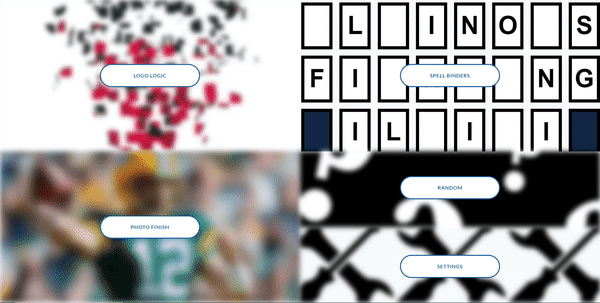
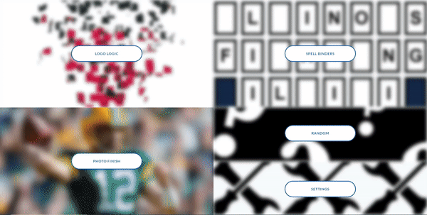
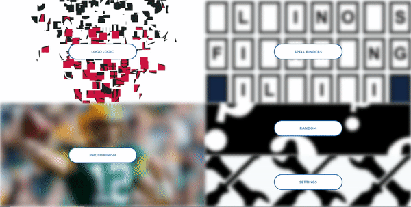

Check out the website here: http://sportstrivia-env.eba-yatziehj.us-east-1.elasticbeanstalk.com/

This project was inspired by the boardgame, "Scene It? Sports Powered by ESPN", which came out in 2005. This has been quite the party game for my friends and I to play. However, many new athletes have emerged, records have been broken, teams have changed since then! We also noticed after many hours of playing that the game just did not have that large of a database of trivia, athletes, and logos.

This new game has all the updated players and logos as well as a much larger database to draw from. Also, the game allows you to select what type of sports and leagues you would like to see during your experience. 

The fun of the game is to yell out as fast as you can what you think the team is or who the athlete is! Check out some examples with a side-by-side comparison of the original game! 
(The GIF's aren't the highest quality, so check out the website for the full experience.)

## Logo Logic 
The logo slowly comes together. 

#### Original: 

#### New:

## Spell Binders 
The team name appears letter by letter on a "Wheel Of Fortune" board.

#### Original: 

#### New:

## Photo Finish
The athlete gradually comes into focus. 

#### Original: 

#### New:

## Intro / Settings 
Select which categories you want to see for each game in the new version. No more having to guess NBA players if you don't watch the NBA!

#### Original: 

#### New:

